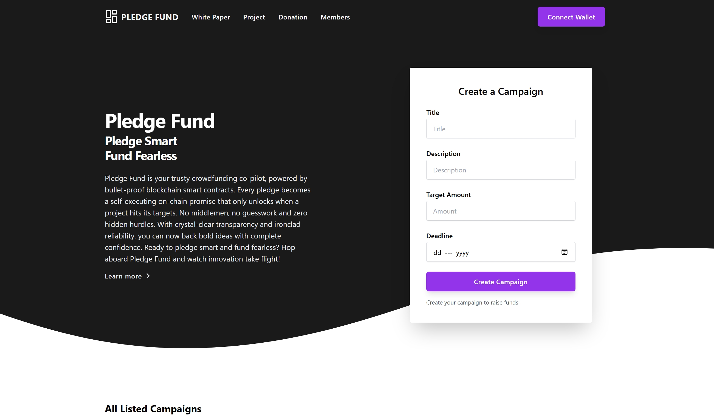

# Decentralized Funding: Building and Deploying a Blockchain Pledge-Fund DApp

Building and Deploying a Blockchain Supply Chain Management DApp

Revolutionize the way projects and ideas are funded with our blockchain crowdfunding DApp. This innovative platform leverages the power of blockchain technology to create a decentralized, transparent, and secure environment for fundraising.

Our crowdfunding DApp enables project creators to raise capital directly from a global pool of investors without the need for intermediaries. By utilizing smart contracts, the DApp automates the fundraising process, ensuring that funds are released to project creators only when predefined milestones are met, thereby increasing accountability and reducing the risk of fraud

## Project Overview



## Instruction

#### Install Vs Code Editor

```
  GET: VsCode Editor
  URL: https://code.visualstudio.com/download
```

#### NodeJs & NPM Version

```
  NodeJs: v18.17.1
  NPM: 8.19.2
  URL: https://nodejs.org/en/download
```
